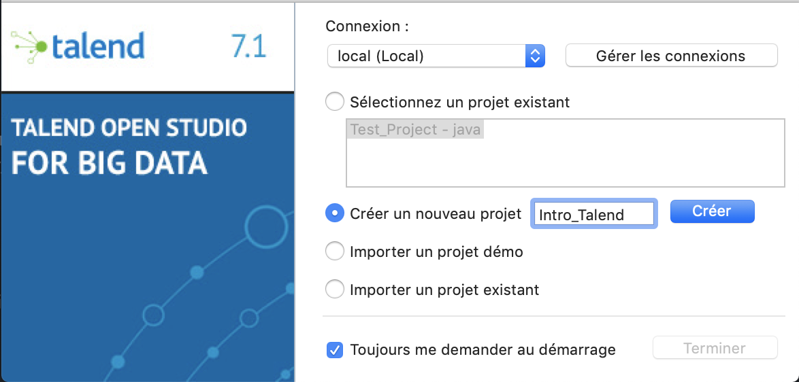

ETL et ELK
==========

<!-- START doctoc generated TOC please keep comment here to allow auto update -->
<!-- DON'T EDIT THIS SECTION, INSTEAD RE-RUN doctoc TO UPDATE -->

- [Introduction](#introduction)
- [Environement technique](#environement-technique)
- [Introduction à Talend](#introduction-%C3%A0-talend)
  - [Démarrage de Talend](#d%C3%A9marrage-de-talend)
  - [L'IHM de Talend](#lihm-de-talend)
    - [Le référentiel](#le-r%C3%A9f%C3%A9rentiel)
    - [Le designer](#le-designer)
    - [La palette](#la-palette)
    - [Fenêtre d'éxécution](#fen%C3%AAtre-d%C3%A9x%C3%A9cution)
  - [Notre premier job Talend](#notre-premier-job-talend)

<!-- END doctoc generated TOC please keep comment here to allow auto update -->

Introduction
------------

Dans ce TP, nous allons étudier un ETL très répendu : Talend.

Talend est un logiciel d'intégration de données développé depuis 2006. Il vient avec polusieurs offres gratuites et payantes, avec des spécifictés pour chaque version.

Au long de ce cours, nous allons utiliser la version Talend Open Studio For Big Data, qui, comme son nom l'indique, s'oriente sur des technos orientées Big Data, et nous propose donc des connecteurs pour communiquer avec les principaux SGBD prévus pour du Big Data.

Pour faire cette partie Big Data, nous allons également étudier une suite de logiciels assez répendus également : la stack ELK.

La stack ELK est composée de trois logiciels :
- ElesticSearch, un SGBD NoSQL orienté documents et index inversés;
- Logstash, un agréagateur de logs applicatifs;
- Kibana, un outil de visualisation de données sous forme graphique.

Dans ce cours, nous nous intéresserons à ElasticSearch et Kibana, Logstash sortant trop du périmètre que je souhaite aborder.

Environement technique
----------------------

Nous allons une fois de plus baser notre environement technique sur Docker pour une grande partie des logiciels que nous allons utilisé. Le seul qui ne sera pas embarqué dans un conteneur est Talend.

Afin de démarrer les conteneurs, nous utiliserons l'habituel `docker-compose up -d` (sans oublier le `docker-compose down` en partant), et afin de démarrer Talend, nous utiliserons un raccourcis contenu dans le script shell `start-talend.sh` situé à la racine de ce répertoire (`./start-talend.sh` pour lancer le soft.)

Notre environement embarque :
- Un serveur MongoDB, accessible sur le port `27017` (localhost:27017)
- Un serveur PostgreSQL, accessible sur le port `5432`, et protéger par le couple user/password postgres/postgres
- Un conteneur Adminer, pour administrer graphiquement PostgreSQL, sur [localhost:8080](http://localhost:8080)
- Un conteneur Mongo-Express, pour administrer graphiquement MongoDB, sur [localhost:8081](http://localhost:8081)
- Une ligne de commande PostgreSQL, accessible via `docker-compose run psql-cli`
- Une ligne de commande MongoDB, accessible via `docker-compose run mongo-cli`

Introduction à Talend
---------------------

Nous allons étudier les bases de Talend, la création de projet, la création et l'éxécution de nos premiers jobs Talend. L'objectif principal est de vous fournir une introduction à Talend, afin que vous soyez en mesure de comprendre un certain nombre de termes que vous serez très certainement amenés à retrouver si vous travailler en tant qu'administrateur de base de données ou en tant que personne analysant de grand jeux de données.

### Démarrage de Talend

Pour ouvrir Talend sur les postes de l'IUT, vous pouvez éxécuter le script dédié à la racine de ce projet (`./start-talend.sh`).

Vous devriez normalement voir un écran de démarrage similaire à l'image suivante :

Après cet écran, Talend vous nous propoer de créer un nouveau projet ou d'ouvrir un projet de démo. Nous allons créer un nouveau projet.

Une fois le projet créé, nous arrivons sur l'accueil de Talend.

Dans la colone centrale, nous allons choisir de créer un nouveau Job.

Un Job Talend est un petit programme écrit en Java (pour pouvoir être portable et exportable n'importe ou sans compilation spécifique à un système) que l'on va pouvoir configurer au travers d'une IHM.

Dans un premier temps, nous devons donner un nom à notre Job Talend.

Une fois nommé, cliquez sur terminer, la fenêtre principale va s'ouvrir devant vous.

Avant de faire un tour d'horizon de l'interface de Talend, il n'est pas impossible que celui-ci vous demande de confirmer l'installation de certains modules. Si tel est le cas, ne cochez que les "Bibliothèques tierces requises".

Cliquez sur "Terminer", une fenêtre va vous demander d'accepter des contrats de licences, sélectionnez "Tout accepter"

On laisse Talend travailler un peu, et il sera ensuite équipé de ce qui nous est nécéssaire pour travailler.

### L'IHM de Talend

L'IHM de Talend est divisée en plusieurs parties, on peut la personnaliser un peu selon nos usages, mais par défaut, elle comporte une zone à gauche, le référentiel, une zone à droite, la palette, et deux zones centrales, le designer et divers onglets sur le contexte d'éxécution.

#### Le référentiel

Le référentiel va comporter tout ce qui concerne notre projet :
- Les différents Jobs Talend
- Les différents environement déxécution
- Les différents puits de données utilisés

#### Le designer

Le designer est l'endroit ou l'on va pouvoir déposer nos différentes briques pour constituer notre Job Talend. Il nous propose également de voir le code Java généré par les différents composants que l'on place sur l'IHM.

#### La palette

La palette de Talend est une grande boite à outil. C'est elle qui contient tout les connecteurs et modules de manipulation de données pour les différentes sources supportées par notre édition de Talend.

#### Fenêtre d'éxécution

Enfin, la dernière partie comporte la fenêtre d'éxécution ainsi que d'autres onglets, mais c'est sur la fenêtre d'éxécution que nous passerons le plus de temps.

### Notre premier job Talend

Nous avons fait le tour de l'IHM et créé un projet comprenant un premier Job Talend. Nous allons maintenant faire un premier job.

Dans un premier temps, nous allons ouvrir un fichier CSV afin d'en extraire des données, que nous allons importer dans notre PostgreSQL ainsi que dans notre MongoDB.

Le jeu de données utilisé, situé dans le répertoire `data/raw`, provient du site [DataHub](https://datahub.io/world-bank/tx.val.tech.cd).
